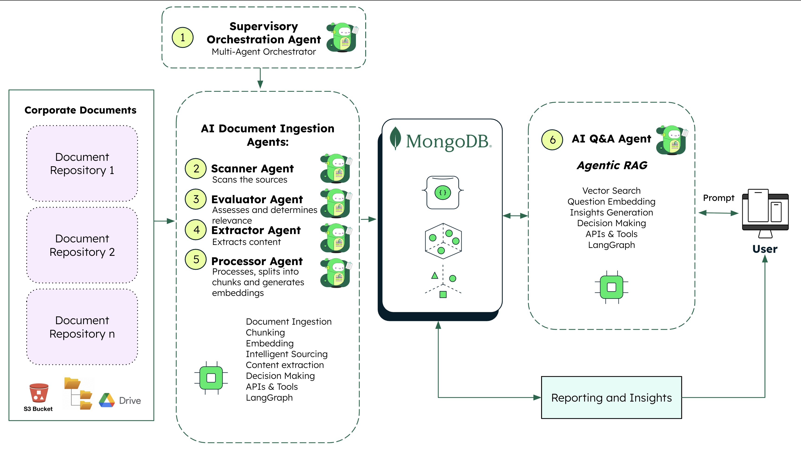
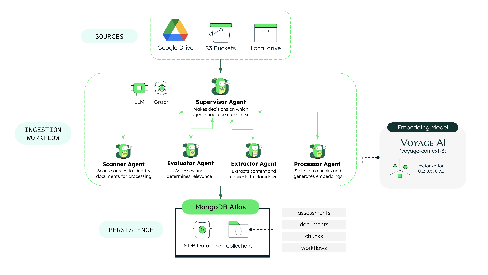
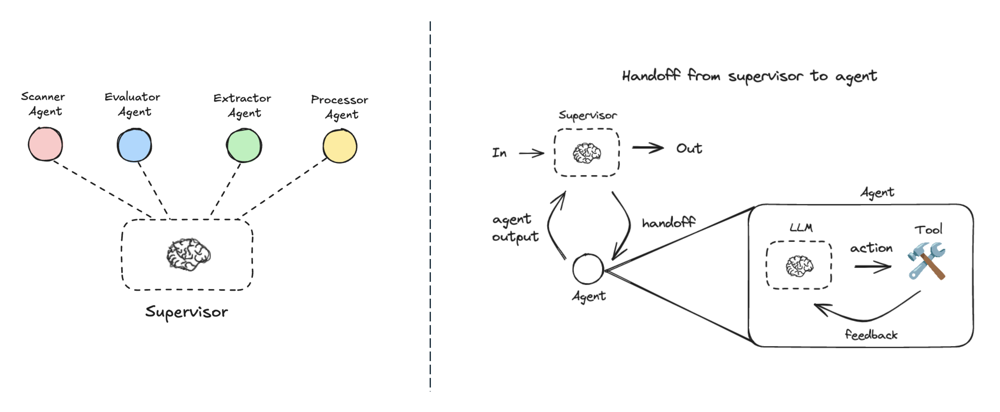
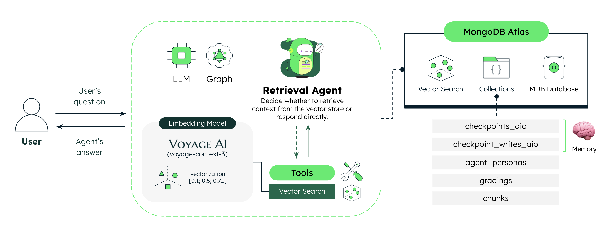
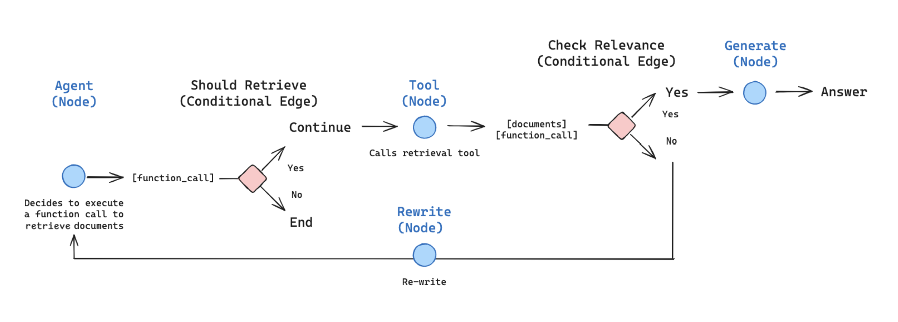
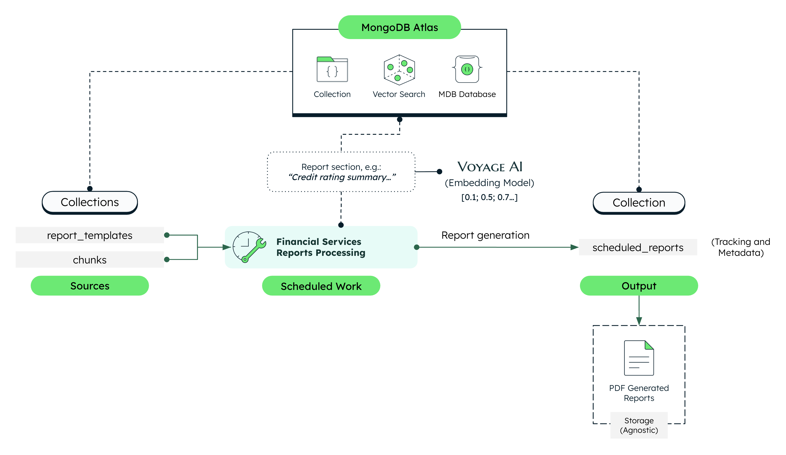

# Document Intelligence UI

Frontend for the FSI Document Intelligence demo application showcasing AI-powered document processing with multi-agent orchestration, agentic RAG, and automated report generation.

> **📘 Backend Repository**: For complete backend architecture, API documentation, see [mongodb-industry-solutions/document-intelligence](https://github.com/mongodb-industry-solutions/document-intelligence)

## 🏗️ System Architecture Overview

The Document Intelligence system demonstrates three architectural patterns powered by MongoDB Atlas:



### **Part 1: Supervisor Multi-Agent Orchestration (Ingestion)**

Specialized agents coordinate document ingestion from multiple sources (Local files, AWS S3, Google Drive) through a supervisor pattern.




### **Part 2: Agentic RAG System (Q&A)**

Self-correcting retrieval with document grading, query rewriting, and conversation memory via MongoDB checkpointing.




### **Part 3: Scheduled Reports (Automation)**

Weekly automated report generation using section-specific semantic search over ingested documents.



**Key Technologies:**
- **Frontend**: Next.js 15, React 19, LeafyGreen UI
- **Backend**: FastAPI, LangGraph, MongoDB Atlas
- **AI Services**: AWS Bedrock (Claude 3.5 Sonnet v2), VoyageAI (voyage-context-3)

## 📁 Frontend Structure

```
frontend/
├── app/                        # Next.js 15 App Router
│   ├── use-case/              # FSI use case selection
│   ├── sources/               # Data source selection + talk tracks
│   ├── document-intelligence/ # Main Q&A interface
│   ├── layout.js              # Root layout with SelectionProvider
│   └── page.js                # Landing page
├── components/                 # React Components
│   ├── assistant/             # DocumentAssistant with Agentic RAG
│   ├── documents/             # DocumentSidebar, DocumentList
│   ├── modals/                # Upload, Citations, Delete modals
│   ├── sources/               # DataSources selector
│   ├── use-case/              # UseCaseSelection cards
│   └── InfoWizard/            # Talk track wizard
├── contexts/                   # React Context
│   └── SelectionContext.js    # Global state management
├── utils/api/                  # API Clients
│   ├── documents/             # Documents & ingestion API
│   ├── reports/               # Reports API
│   └── upload/                # Upload API
└── public/diagrams/            # Architecture diagrams (PNG)
```

## 🚀 Getting Started

### Prerequisites
- **Node.js** >= 22.0.0
- **Backend API** running (see [backend repository](https://github.com/mongodb-industry-solutions/document-intelligence))

### Installation

```bash
cd frontend
npm install
```

### Environment Setup

Create `frontend/.env.local`:

```bash
# Backend API URL (FastAPI)
NEXT_PUBLIC_API_URL=http://localhost:8000
```

> **Note**: The frontend communicates only with the FastAPI backend, not directly with MongoDB.

## 🛠️ Development

### Run Development Server

```bash
cd frontend
npm run dev
```

The app will be available at `http://localhost:3000`

### Build for Production

```bash
npm run build
npm start
```

### Docker

```bash
# Build and run frontend container
docker-compose up --build document-intelligence-frontend
```

## 🎯 Application Flow

### User Journey

1. **Use Case Selection** (`/use-case`)
   - Choose from FSI use cases: Credit Rating, Investment Research, KYC Onboarding, Loan Origination, Payment Processing Exception

2. **Data Sources** (`/sources`)
   - Select document sources: Local files, AWS S3, Google Drive
   - View architectural talk tracks for each system part
   - Sync sources to trigger ingestion workflow

3. **Document Intelligence** (`/document-intelligence`)
   - View processed documents in sidebar
   - Ask questions using Agentic RAG
   - Review citations and sources
   - Generate and view scheduled reports

### FSI Use Cases

The UI supports these financial services use cases:
- **Credit Rating**: Analyze credit reports and ratings
- **Investment Research**: Research financial instruments
- **KYC Onboarding**: Know Your Customer verification
- **Loan Origination**: Loan application processing
- **Payment Processing Exception**: Payment issue resolution

> **Backend Details**: For API endpoints, MongoDB collections and document sources configuration, see the [backend repository](https://github.com/mongodb-industry-solutions/document-intelligence)

## 📚 Additional Resources

- **Backend Repository**: [mongodb-industry-solutions/document-intelligence](https://github.com/mongodb-industry-solutions/document-intelligence)
- **MongoDB Atlas Vector Search**: [Vector Search Documentation](https://www.mongodb.com/docs/atlas/atlas-vector-search/)
- **VoyageAI**: [voyage-context-3 Embeddings](https://blog.voyageai.com/)
- **LangGraph**: [Multi-Agent Systems](https://langchain-ai.github.io/langgraph/concepts/multi_agent/)

## 📄 License

See [LICENSE](LICENSE) file for details.
